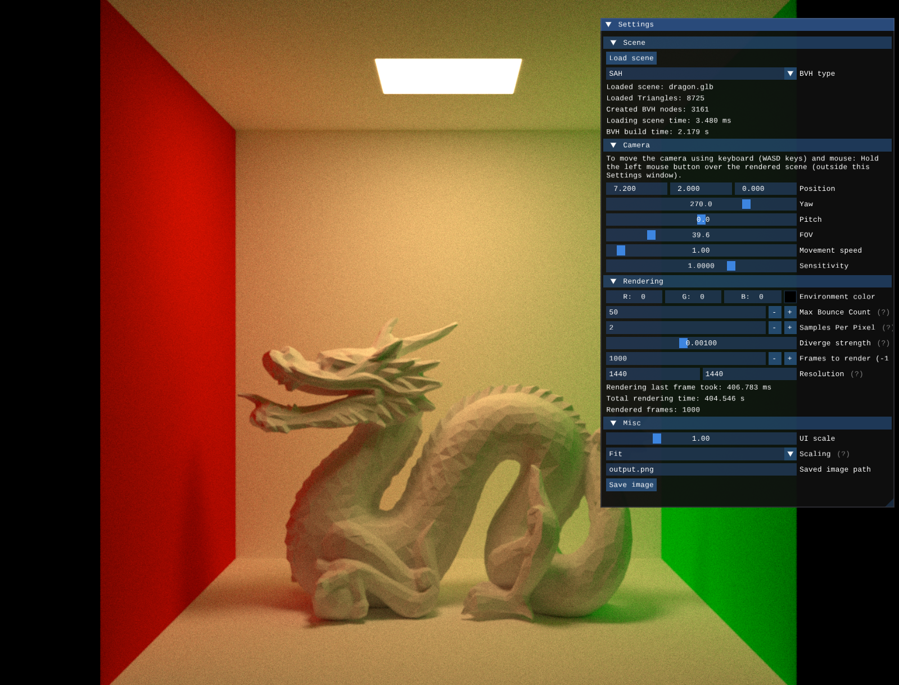

# Path Tracing Renderer
Interactive Path Tracing Renderer with an OpenGL backend, written in C.




## Current features:
- GUI to control internal rendering parameters
- Support for many GPUs thanks to OpenGL 4.6
- Basic support of glTF 2.0
- Move the camera around the scene
- Save rendered image to file
- Two BVH types are available: Midpoint split and a 
[Surface Area Heuristic](https://web.archive.org/web/20260328124611/https://jacco.ompf2.com/2022/04/18/how-to-build-a-bvh-part-2-faster-rays/)
- Settings available from CLI 


## Building
***NOTE***: Prebuilt binaries for Windows, macOS and Linux can be downloaded from the [Releases page](https://github.com/MaksRawski/Path-Tracing-Renderer/releases).


This project uses submodules for its dependencies, so make sure to get them too while cloning.
```
git clone https://github.com/MaksRawski/PathTracingRenderer --recurse-submodules
```

If you have cloned without submodules, run this inside the project directory
```
git submodule update --init --recursive
```

The only system dependencies on Linux are `make`, `cmake` a C compiler and whatever 
[GLFW needs](https://www.glfw.org/docs/latest/compile.html#compile_deps_wayland).

On Windows and macOS, [cmake](https://cmake.org/download/) and a C compiler should be enough.

Once you have them, you can build the project using either Make (recommended for Linux) or CMake (only option for Windows, and the recommended one for macOS).

### Make
Build dependencies 
```
make -Clib
```

Build the project
```
make MODE=release
```

Run it
```
./build/release/main
```

Run tests:
```
make tests
```

### CMake
Configure 
```
cmake -Bbuild -DCMAKE_BUILD_TYPE=Release
```

Build the project
```
cmake --build build
```

Run it
```
./build/PathTracingRenderer
```

Run tests:
```
cmake -Bbuild -DBUILD_TESTS=ON && cmake --build build && ./build/tests
```


## Coding conventions
### Naming
- `snake_case` for function\_names, variable\_names and struct\_members
- `PascalCase` for StructNames
- `MACRO_CASE` for macros


- `StructName_new` for "constructors" and `StructName_delete` for "destructors"
- `StructName_function_name` for functions that operate on a given struct directly
- `function__template` for macros that expand into function definitons
- a pair of `MACRO_NAME` and `MACRO_NAME_impl` for functions that need `__LINE__` and `__FILE__`
- `MACRO_NAME_` for a not to be used directly macro 

### Other
- "private" struct functions/helper functions are `static` defined within the same translation unit.
- stack allocation is heavily preferred
    - functions that "return a string" take a `char *buf` as argument or return either `SmallString` (`char[1024]`) or `TinyString` (`char[16]`)
    - 16MB Arena is allocated at the beginning of main and is passed around for all temporary allocations needs
    - only big allocations (theoretically gigabytes) are `malloc`'ed
- `stdint.h` types are preferred over `int`, `long` etc. 
